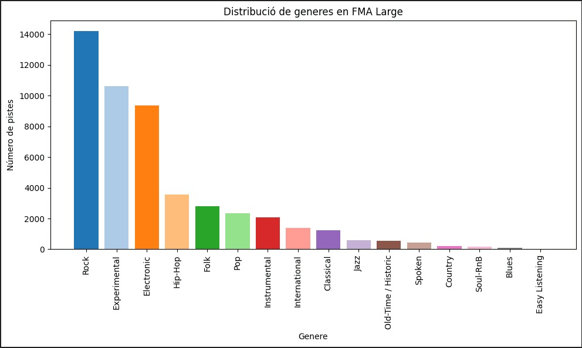
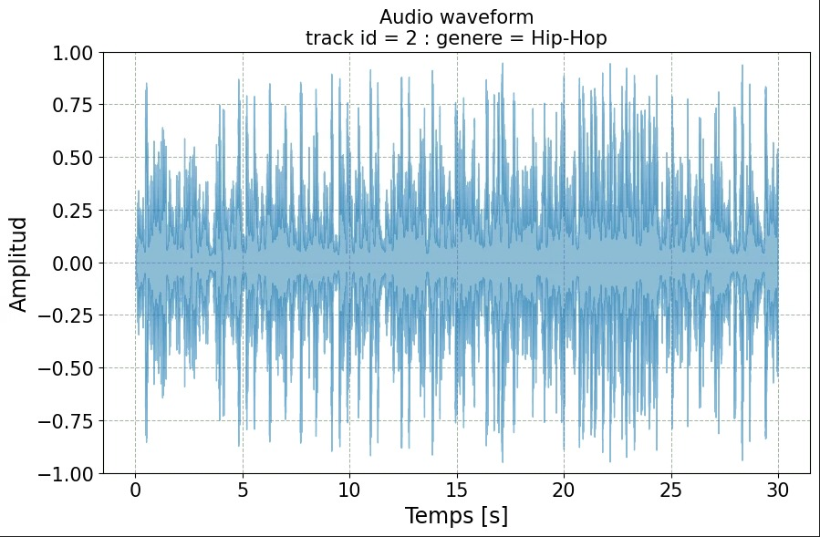
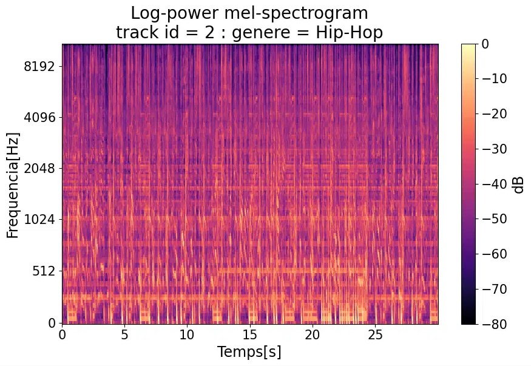

# Music Genre Classification
La classificació de gèneres musicals és una tasca clàssica dins el camp de l’aprenentatge automàtic aplicat a àudio. Amb l’ús d’espectrogrames Mel com a representació visual del so, aquesta tasca es pot abordar com un problema de classificació d’imatges, permetent l’ús de diverses arquitectures de xarxes neuronals.

Aquest projecte té com a objectiu comparar el rendiment de diferents arquitectures de xarxes neuronals per a la classificació de gèneres musicals a partir d’espectrogrames Mel extrets d’àudio. En concret, s’analitza si les xarxes convolucionals, tant unidimensionals com bidimensionals, i les xarxes recurrents, com GRU i LSTM, són capaces d’oferir resultats satisfactoris i comparables en aquesta tasca. L’objectiu no és necessàriament trobar el model més precís, sinó entendre com aquestes diferents arquitectures responen davant el problema, valorant la seva eficàcia i comportament.

Per tal de fer el seguiment dels entrenaments, comparar resultats i optimitzar el model amb visualitzacions i control d’hiperparàmetres, hem utilitzat la plataforma [Weights & Biases](https://wandb.ai/site).


---
## Estructura del repositori
Aquest repositori conté els següents fitxers:
- `imatges`: Diagrames de les arquitectures i gràfics (losses, f1-score, matrius de confusió, etc.)
- `models`: Arquitectures de models
- `utils`: Funcions auxiliars per preparar dades, crear datasets i inicialitzar el model
- `dataAugmentation.py`: Inclou transformacions per augmentar espectrograms (masking, shifting, soroll, etc.)
- `feature_extraction.py`: Extracció d’espectrogrames Mel
- `tnse.py`: Codi per executar el TNSE d'un model guardat
- `main.py`: Punt d'entrada: configura l'entorn, carrega dades, entrena i avalua el model amb wandb
- `train.py`: Entrenament
- `test.py`: Funció de test i mètriques
- `environment.yml`: Entorn conda amb dependències
- `slides_projecte.pdf`: Presentació en format pdf que resumeix el projecte
- `arquitectures.md`: Explicació detallada de les arquitectures implementades
- `resultats.md`: Resultats finals i anàlisi
- `test.md`: Explicació detallada del procés de test
- `README.md`: Aquest mateix arxiu el qual conté la informació principal

---

## Dataset
Per a la realització d'aquest projecte hem escollit un dels [datasets facilitats](https://github.com/ismir/mir-datasets/blob/master/outputs/mir-datasets.md), concretament, hem treballat amb  el FMA (Free Music Archive). D’entre tots els datasets disponibles, vam seleccionar aquest perquè conté arxius d’àudio reals i etiquetats amb el gènere musical, cosa que el fa especialment adequat per entrenar xarxes neuronals convolucionals.

Aquest repositori de GitHub constava de 3 datasets, diferenciats per la quantitat d'arxius que contenen. El primer, el FMA_small, el vam utilitzar inicialment per familiaritzar-nos amb el codi donat i per poder construir una primera arquitectura per començar a entrenar el nostre model. Un cop vam tenir accés a les GPUs vam passar a treballar amb el dataset FMA_large.

Hem de conèixer les limitacions del dataset de cara al nostre projecte:
- Àudios limitats a clips de 30 segons
- Els límits dels gèneres poden ser subjectius
- Algunes cançons poden encaixar en múltiples gèneres 
- La qualitat de l'àudio varia entre cançons
---

## Com executar el codi?
Abans de fer correr el codi heu de crear l'entorn local amb conda i activar-ho. El fitxer [environment.yml](https://github.com/DCC-UAB/XNAP-Project/environment.yml) té totes les dependències requerides. Executeu la següent comanda: ``conda env create --file environment.yml `` per crear l'entorn i després activar-lo:
```
conda activate xnap-example
```

Per activar el codi (tot el procés de càrrega del dataset, train i test amb el model seleccionat), heu d'executar:
```
python main.py
```

### Punts clau en l'execució:

- A l'hora d'executar per primer cop tingueu en compte que s'han d'extreure totes les característiques (mel spectrograms) i necessita un bon temps de còmput.
- Si no disposeu de GPU l'execució del train pot arribar a ser molt elevada.
- Per canviar el tipus de característica (de mel spectrogram a MFCC), en ``main.py`` heu de donar el valor corresponent a la variable: *feature_type = "mfcc" o "mel"*
- Per canviar el tipus d'arquitectura utilitzada, heu d'anar a ``utils.py`` i en la funció make() descomentar el model que es vulgui utilitzar.

---

## Exploratory data analysis
Per tal d'entendre i visualitzar millor la distribució i les característiques del conjunt de dades, es va realitzat un anàlisi exploratori de dades (EDA).

Primerament, es va fer un recompte del nombre de gèneres i del nombre de tracks per gènere. En aquest pas es va observar una gran quantitat de registres que no disposaven de cap gènere assignat, els quals van ser tractats en el preprocessament. Es va generar un gràfic de barres per representar la distribució de les pistes segons el seu gènere principal. Aquesta visualització facilita la detecció de desproporcions entre gèneres, com per exemple, si alguns estan sobrerepresentats mentre que altres tenen molt pocs exemples.

 

*Figura 1: Distribució tracks per gènere*

A partir del gràfic es pot observar clarament que la distribució de gèneres és molt desbalancejada. En total, el conjunt de dades consta de 16 gèneres musicals diferents. D'entre els gèneres més representats tenim Rock (14182 tracks), Experimental (10608) i Electronic (9372). D'altra banda, gèneres com Jazz, Old-Time/Historic, Spoken, Country, Soul-RnB, Blues tenen menys de 1000 tracks, destacant Easy-Listening que en té només 24. Aquest desbalanceig cal tenir-lo en compte a l’hora d’entrenar i avaluar els models, ja que pot afectar el seu rendiment i la seva capacitat de generalització.

Per aprofundir en el tipus de dades amb què es treballa, es va seleccionar un track per visualitzar la seva ona d’àudio, que mostra l’amplitud en funció del temps.



*Figura 2: Exemple ona d'àudio d’un track*

---
## Feature extraction

Per no haver d’executar la conversió d’àudio a espectrograma a cada sessió, vam extreure totes les característiques i les vam emmagatzemar en un fitxer `HDF5`. Aquest procés es va realitzar principalment amb la llibreria `librosa`, una eina de referència per al processament d’àudio en Python. Els passos concrets són:

- Vam carregar cada arxiu d’àudio i ens vam assegurar que tots tinguessin la mateixa duració (30 segons). Si un arxiu era més curt, s’omplia amb silenci (zeros), i si era més llarg, es retallava.
- A partir del senyal d’àudio, es va generar l’espectrograma Mel, una representació visual que mostra com l’energia de diferents bandes de freqüència canvia al llarg del temps. Per fer-ho, primer s’aplica una Transformada de Fourier de curta durada (STFT) sobre finestres temporals, i després es mapeja l’espectre a l’escala de Mel, que imita la percepció humana del so.



*Figura 3: Exemple d’espectrograma Mel d’un track d’àudio.*

- Els valors obtinguts es converteixen a dB (decibels) utilitzant l’escala logarítmica per comprimir les diferències extremes d’intensitat sonora (el rang dinàmic) i fer més rellevants les variacions suaus de so. Posteriorment, el resultat és una imatge 2D que vam normalitzar amb valors entre 0 i 1.
- El resultat és una imatge 2D que té una forma final de (128, 1292), on 128 és el nombre de bandes de Mel i 1292 és el nombre de passos temporals per track.
- També vam transformar cada gènere musical a un número, perquè el model pugui treballar amb etiquetes numèriques en lloc de text.
- Finalment, vam guardar totes aquestes dades (imatges i etiquetes) en un sol arxiu `HDF5`, per no haver de repetir el procés d’extracció cada vegada que entrenem el model.

Gràcies a aquest procés, només cal llegir el fitxer `HDF5` durant l’entrenament, la qual cosa redueix dràsticament el temps de preparació i permet aprofitar millor els recursos de la GPU.


---
## Preprocessament

Inicialment, el dataset comptava amb 106.574 pistes, però moltes d’elles no tenien un gènere assignat (valor `NaN` a la columna `genre_top`). Aquestes van ser eliminades, reduint el conjunt a 49.598 tracks amb etiquetes vàlides. A més, com hem vist a l'apartat d'EDA, comptem amb gèneres que tenen poca representació. Degut a aquest desbalanceig, en algunes proves hem decidit prescindir d'algun d'aquests gèneres per veure com variava el resultat.

Un cop teniem les dades del Metadata netejades (número de track i gènere), vam verificar que totes tinguessin assignat un fitxer d'àudio .mp3 (en la carpeta FMA_large)
 

Un cop obtingut el conjunt final de dades, es va aplicar data augmentation mitjançant tècniques com Frequency masking, Time masking, RandomShift, AddNoise i FrequencyShift per enriquir el dataset i millorar la generalització del model. Finalment, es va dividir el conjunt en 3 particions: entrenament (80%), validació (10%) i test (10%), mantenint sempre la distribució de gèneres per evitar biaixos en els diferents subsets.


## Contributors
Nerea de la Torre Veguillas, nerea.delatorre@autonoma.cat

Mara Montero Jurado, mara.montero@autonoma.cat

Júlia Morán Fluvià, julia.moran@autonoma.cat

Adrián Prego Gallart, adrian.prego@autonoma.cat


Xarxes Neuronals i Aprenentatge Profund
Grau de Computational Mathematics & Data analyitics, 
UAB, 2025
